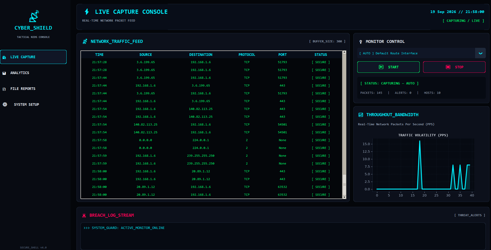

# NIDS Pro — Network Intrusion Detection System

NIDS Pro is a signature-based Network Intrusion Detection System designed to monitor network traffic and detect suspicious activities using rule-based detection.

## Features

- Real-time network traffic monitoring
- Source IP and destination IP analysis
- Protocol and port monitoring
- Signature-based intrusion detection
- Suspicious activity alerts
- Port scan detection
- Network traffic statistics
- Security monitoring dashboard
- Alert and report generation

## Technologies & Tools

- Python
- PyQt6
- Scapy
- SQLite
- Nmap
- Linux / Kali Linux
- Windows

## Detection Rules

NIDS Pro uses rule-based detection for potentially risky network services and suspicious traffic patterns, including:

- Telnet — Port 23
- FTP — Port 21
- SSH — Port 22
- HTTP — Port 80
- HTTPS — Port 443
- Port scanning activity
- High-volume traffic / DoS patterns

## Project Structure

```text
NIDS-Pro/
├── main.py
├── detection.py
├── packet_capture.py
├── database.py
├── alert.py
├── analytics.py
├── report.py
├── config.py
├── feature_engine.py
├── log_utils.py
└── gui/
## Dashboard

